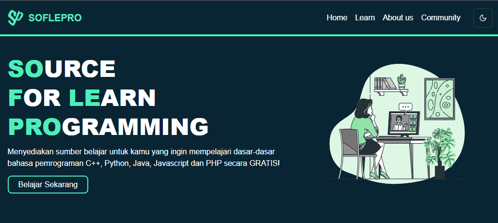

# 🚀 SoflePro - Platform Pembelajaran Programming



## 📚 Tentang SoflePro

SoflePro adalah platform pembelajaran programming yang dirancang untuk membantu para developer pemula hingga menengah dalam mempelajari berbagai bahasa pemrograman dan framework populer. Platform ini menyediakan akses ke konten pembelajaran terstruktur dari berbagai sumber terpercaya.

## ✨ Fitur Utama

- 🎯 **Pembelajaran Terstruktur**: Materi pembelajaran yang disusun secara sistematis dari dasar hingga lanjutan
- 🔄 **Multi Bahasa**: Mendukung berbagai bahasa pemrograman populer (JavaScript, Python, Java, PHP)
- 🛠 **Framework Learning**: Pembelajaran framework terkini (React, Django, Spring Boot, Laravel)
- 📱 **Responsive Design**: Tampilan yang responsif untuk akses di berbagai perangkat
- 🌙 **Dark Mode**: Dukungan mode gelap untuk kenyamanan pembelajaran
- 🎥 **Video Tutorial**: Akses ke video pembelajaran berkualitas

## 🛠 Tech Stack

- **Framework**: [Next.js 14](https://nextjs.org/)
- **Styling**: [Tailwind CSS](https://tailwindcss.com/)
- **State Management**: React Context
- **Deployment**: [Vercel](https://vercel.com)

## 🚀 Quick Start

1. **Clone Repository**
   ```bash
   git clone https://github.com/yourusername/soflepro.git
   cd soflepro
   ```

2. **Install Dependencies**
   ```bash
   npm install
   # atau
   yarn install
   ```

3. **Run Development Server**
   ```bash
   npm run dev
   # atau
   yarn dev
   ```

4. **Buka Browser**
   Buka [http://localhost:3000](http://localhost:3000) di browser Anda.

## 📁 Struktur Project

```
/soflepro
├── /public                 # Static assets
├── /src
│   ├── /app               # Next.js 14 app router
│   ├── /components        # Reusable components
│   ├── /utils            # Helper functions
│   └── /styles           # Global styles
```

## 🌟 Fitur Mendatang

- [ ] Authentication & User Profiles
- [ ] Progress Tracking
- [ ] Quiz & Assessments
- [ ] Code Editor Integration
- [ ] Community Forum
- [ ] Certificate Generation

## 🤝 Kontribusi

Kami sangat terbuka untuk kontribusi! Jika Anda ingin berkontribusi:

1. Fork repository ini
2. Buat branch baru (`git checkout -b feature/AmazingFeature`)
3. Commit perubahan Anda (`git commit -m 'Add some AmazingFeature'`)
4. Push ke branch (`git push origin feature/AmazingFeature`)
5. Buka Pull Request

## 📝 Lisensi

Project ini dilisensikan di bawah [MIT License](LICENSE).

## 👥 Tim

- Developer - [Your Name](https://github.com/yourusername)
- Designer - [Designer Name](https://github.com/designerusername)

## 📞 Kontak

- Website: [yourdomain.com](https://yourdomain.com)
- Email: your.email@domain.com
- Twitter: [@yourusername](https://twitter.com/yourusername)

---

<p align="center">Made with ❤️ by SoflePro Team</p>